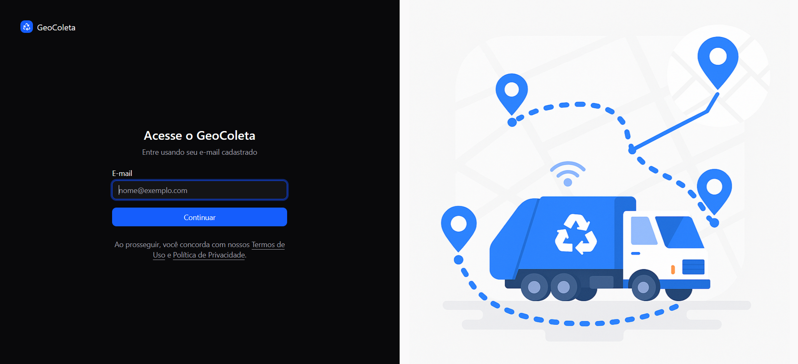
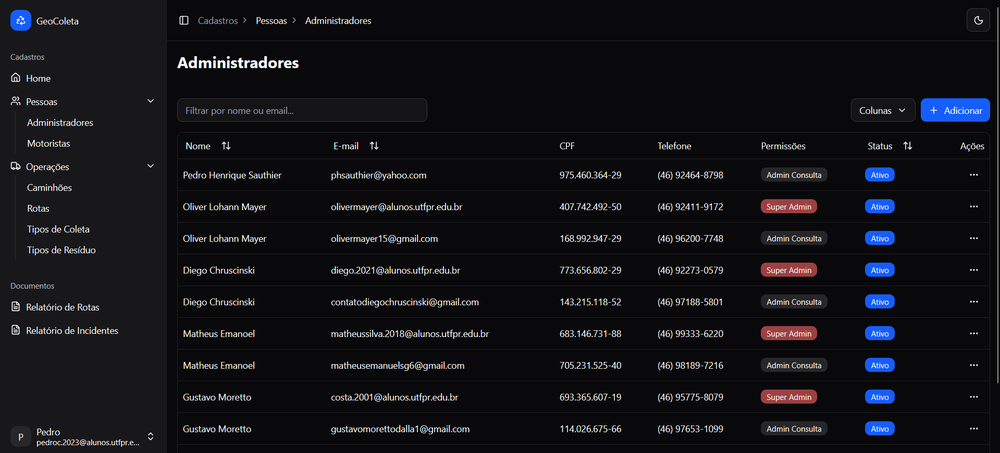
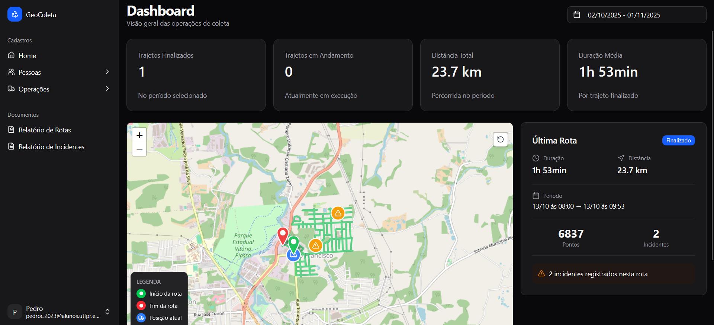
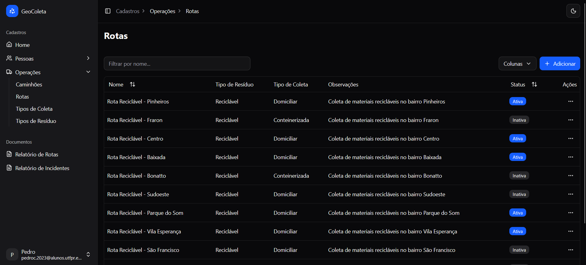
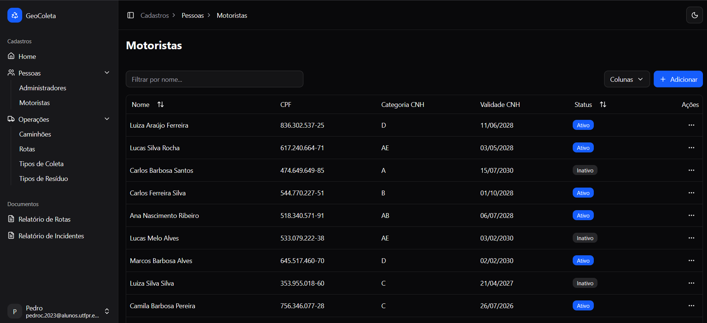
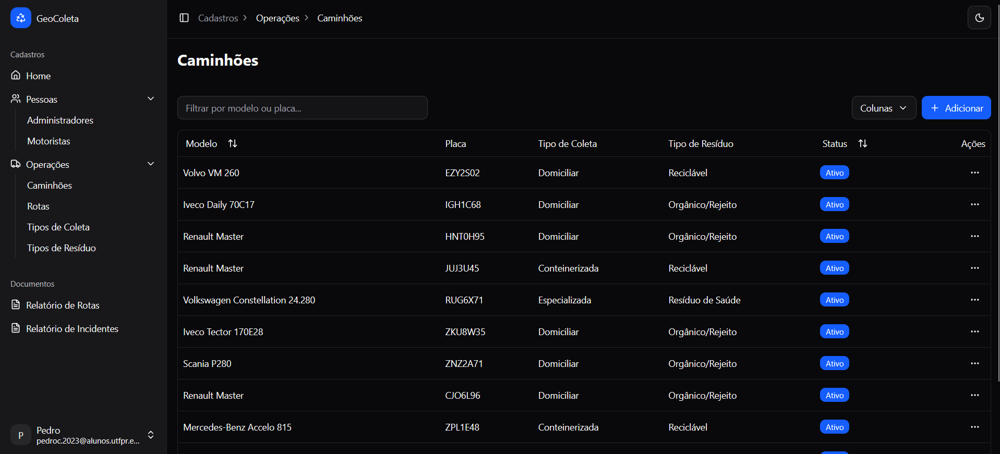

# Geo Coleta - Frontend Web

## Visão Geral

O projeto Geo Coleta é uma plataforma web desenvolvida para otimizar a gestão da coleta de resíduos urbanos. Através de uma interface intuitiva, a aplicação permite o monitoramento em tempo real das rotas de coleta, o gerenciamento de motoristas e caminhões, e a geração de relatórios detalhados para análise e tomada de decisão.

Este documento descreve a arquitetura, os componentes e os fluxos do módulo frontend do sistema, construído com React, Vite e TypeScript.

## Telas Principais

### Login


### Gerenciamento de Administradores


### Dashboard


### Gerenciamento de Rotas


### Gerenciamento de Motoristas


### Gerenciamento de Caminhões


## Funcionalidades

### Telas Implementadas
- **Login:** Autenticação de usuários com sistema de código de verificação via e-mail.
- **Dashboard:** Apresenta um mapa interativo com as rotas, estatísticas de coletas e informações relevantes.
- **Gerenciamento de Administradores:** Cadastro, edição e exclusão de usuários administradores.
- **Gerenciamento de Motoristas:** Cadastro, edição e exclusão de motoristas.
- **Gerenciamento de Caminhões:** Cadastro, edição e exclusão de caminhões.
- **Gerenciamento de Tipos de Coleta:** Definição dos tipos de coleta que a cidade atende.
- **Gerenciamento de Tipos de Resíduo:** Definição dos tipos de resíduo que a cidade coleta.
- **Gerenciamento de Rotas:** Cadastro, edição e exclusão de rotas.

### Telas Pendentes
- **Gerenciar Código de Acesso do App:** Geração e gerenciamento de códigos para acesso ao aplicativo mobile.
- **Geração de Relatórios:** Ferramenta para gerar relatórios customizados sobre a operação.
- **Mapa de Trajetos:** Visualização detalhada do trajeto percorrido pelos caminhões.

## Estrutura de Pastas

A estrutura de pastas do projeto segue um padrão modular e escalável, visando a organização e a manutenibilidade do código.

```
/src
|-- /app.tsx
|-- /main.tsx
|-- /assets
|-- /components
|   |-- /ui
|   |-- /layout
|   |-- /forms
|   |-- /dashboard
|   |-- /... (outros componentes específicos)
|-- /contexts
|-- /hooks
|-- /http
|   |-- /auth
|   |-- /caminhoes
|   |-- /motoristas
|   |-- /rotas
|   |-- /... (outros endpoints)
|-- /layouts
|-- /lib
|-- /pages
|-- /services
```

- **`assets`**: Armazena imagens, ícones e outros recursos estáticos.
- **`components`**: Contém componentes React reutilizáveis, divididos em `ui` (genéricos), `layout` (estrutura da página), `forms` (formulários), `dashboard` (componentes do dashboard) e outros específicos de cada módulo.
- **`contexts`**: Provedores de contexto para gerenciamento de estado global (autenticação, loading, etc.).
- **`hooks`**: Hooks customizados para lógica reutilizável.
- **`http`**: Centraliza a lógica de comunicação com a API, incluindo hooks do `react-query` para cada endpoint.
- **`layouts`**: Componentes de layout principais da aplicação.
- **`lib`**: Funções utilitárias, configurações e constantes.
- **`pages`**: Componentes que representam as páginas da aplicação.
- **`services`**: Serviços de integração, como a instância do `axios` (`api.ts`) e o gerenciamento de token (`token-storage.ts`).

## Configuração e Execução Local

### Pré-requisitos
- Node.js (versão 20.x ou superior)
- npm (ou um gerenciador de pacotes compatível)

### Instalação
1. Clone o repositório:
   ```bash
   git clone https://github.com/seu-usuario/geocoleta-web.git
   ```
2. Navegue até o diretório do projeto:
   ```bash
   cd geocoleta-web
   ```
3. Instale as dependências:
   ```bash
   npm install
   ```

### Variáveis de Ambiente
Crie um arquivo `.env` na raiz do projeto, baseado no `.env.example`, e configure a variável de ambiente para a URL da API:

```
VITE_API_URL=http://localhost:"Porta gerada no npm run dev"
```

### Execução
Para iniciar o servidor de desenvolvimento, execute:

```bash
npm run dev
```

A aplicação estará disponível em `http://localhost:5173`, por exemplo.

## Scripts Disponíveis

- **`npm run dev`**: Inicia o servidor de desenvolvimento com Hot Reload.
- **`npm run build`**: Compila e otimiza a aplicação para produção.
- **`npm run preview`**: Visualiza a versão de produção localmente.
- **`npm run lint`**: Executa a verificação de estilo de código com o Biome.
- **`npm run lint:fix`**: Corrige automaticamente os problemas de estilo de código.
- **`npm run format`**: Formata o código com o Biome.
- **`npm run type-check`**: Realiza a verificação de tipos do TypeScript.

## Build para Produção

Para gerar a versão de produção do projeto, execute o comando:

```bash
npm run build
```

Os arquivos otimizados serão gerados no diretório `dist`.

## Integração com a API

A comunicação com a API é realizada através do `axios` e gerenciada pelo `react-query`. Os hooks de mutação e consulta para cada recurso da API estão localizados na pasta `src/http`.

A autenticação é baseada em token (JWT), que é armazenado no `localStorage` e enviado em todas as requisições para a API.

## Dependências

### Principais
- **React 19**: Biblioteca para construção de interfaces de usuário.
- **React Router DOM**: Para roteamento no lado do cliente.
- **TypeScript**: Superset do JavaScript que adiciona tipagem estática.
- **Vite**: Ferramenta de build e desenvolvimento rápido.
- **Tailwind CSS 4**: Framework CSS para estilização.
- **shadcn/ui**: Biblioteca de componentes acessíveis e reutilizáveis.
- **TanStack Query (React Query)**: Para gerenciamento de estado assíncrono e caching de dados.
- **Zod**: Para validação de esquemas e tipos.
- **React Hook Form**: Para construção de formulários.


### Desenvolvimento
- **Biome**: Linter e formatador de código.
- **ESLint**: Para análise estática de código.
- **TypeScript**: Para verificação de tipos.

Para a lista completa de dependências, consulte o arquivo `package.json`.